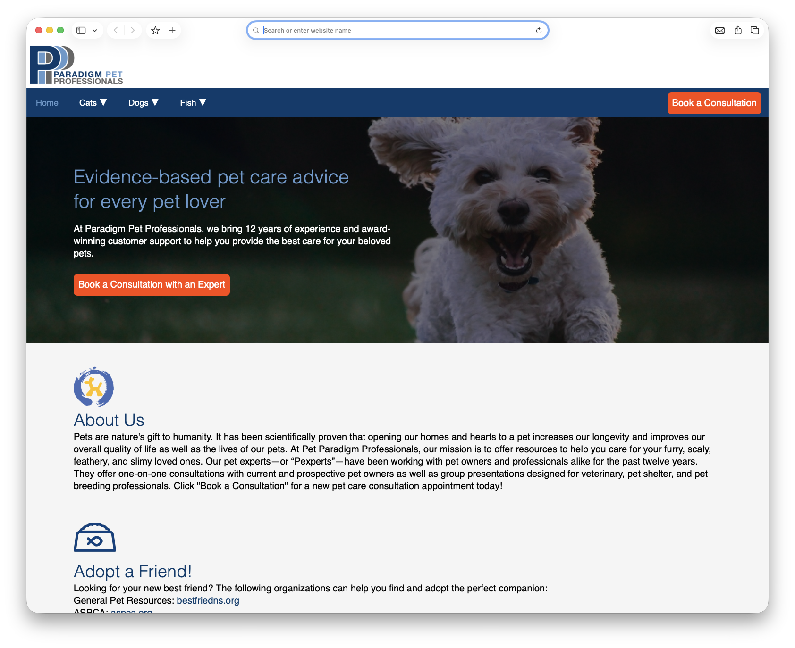
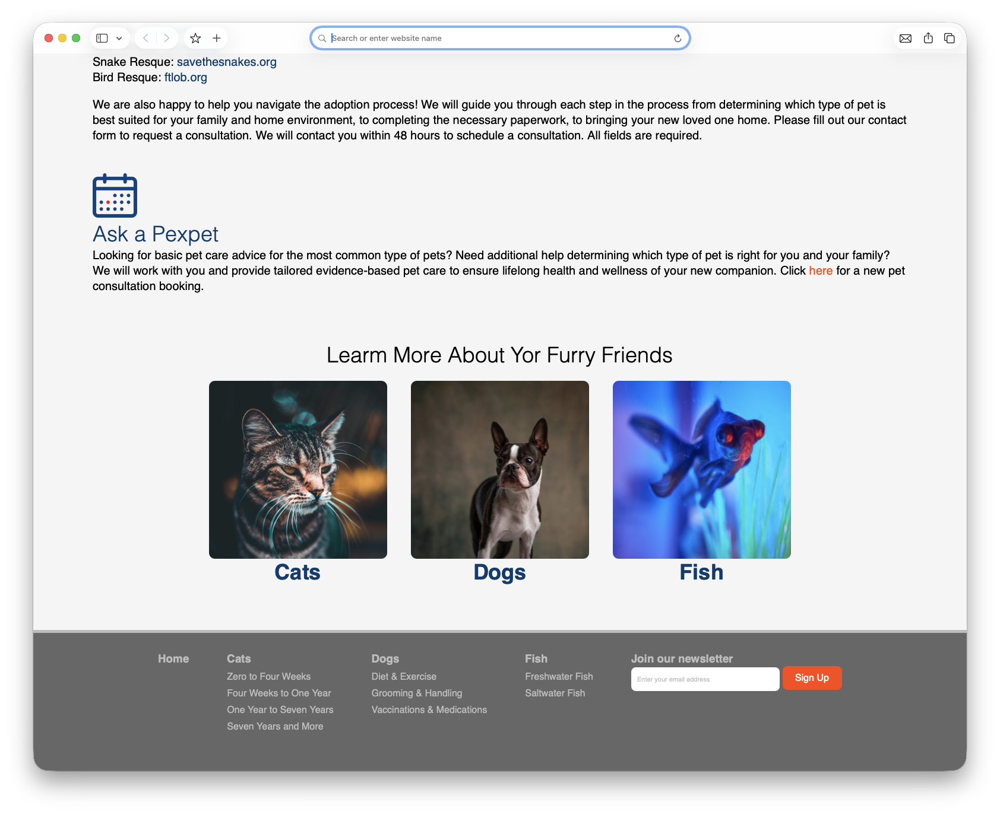

# User Interface Design Project

## Overview
This repository contains my User Interface Design project for a fictinonal company that specializes on pet health advice. It showcases my work in UX/UI design and building a user-friendly interface with a focus on layout, usability, visual structure, and accessibility.

The purpose of this project is to demonstrate my understanding of front-end design principles and how to create an interface that is both functional, visually appealing and easy to navigate both from a desktop and a mobile device.



## Features
- Clean and organized user interface
- Consistent footer and header all pages
- CTA (Call to action) buttons
- Responsive layout
- Easy-to-use navigation
- Desktop and mobile friendly

## Technologies Used
- HTML
- CSS
- JavaScript

## Project Goals
This project was created to:
- Practice UI design and front-end development
- Improve layout and styling skills
- Demonstrate basic web development knowledge

## How to Run the Project
1. Clone this repository:
   ```bash
   git clone https://github.com/icozm/User-Interface-Design-Project.git
   ```
2. Open the project folder
3. Open index.html in your browser and navigate the website

# Author: 
- Ivan Cozmulici 
- GitHub: https://github.com/icozm
